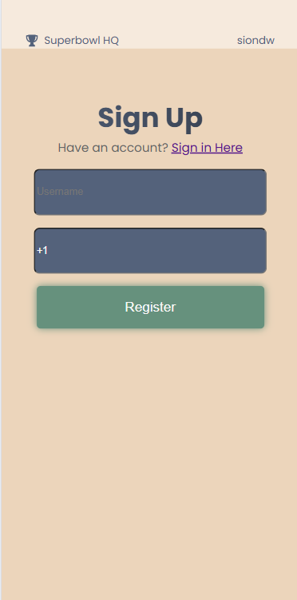

## Project Overview for the SBHQ App

### The Idea:

The app is a **live sports-prop quiz platform** where users register, join live "quiz lobbies" (structured as matches), and compete by answering real-time sports-related prop questions. The unique aspect of this app is the role of the **Game Master**, who dynamically controls the flow of questions and submissions during live events. The goal should be to be able to handle a lobby of 100-1000 users simultaneously, without crashes.

### Note
The old db structure json file is in old-db.json. When you run the emulators you can import this to view the app as it is now. We do want to migrate to the stucture outined below

### How It Works:

1. **Live Quiz Lobbies**: Users register and join a live quiz lobby. Each lobby corresponds to a live sports event or match.
2. **Game Master Controls**: The Game Master poses prop-based questions to users in real-time. For example:
   - **Question**: "What will be the first play of the drive?"
   - **Options**: "Run" or "Pass"
3. **User Submissions**: Users select their answers within a time window controlled by the Game Master.
   - Submissions are locked when the Game Master closes the question.
4. **Waiting for Results**: Once users submit answers, everyone waits for the actual event (e.g., the first play of the drive) to occur in the live sports match.
5. **Game Master Validation**: After the event occurs, the Game Master submits the correct answer (e.g., "Run").
6. **Advancement/Elimination**: Based on their answers:
   - Users who answered correctly advance to the next question.
   - Users who answered incorrectly are eliminated.

This process repeats until only one winner remains or the event ends.

### Key Aspects:

- **Interactive and Dynamic**: The Game Master’s control ensures a highly engaging and flexible experience.
- **Sports-Prop Focus**: The questions revolve around live sports betting-style props, making it unique and appealing to sports fans.
- **Real-Time Engagement**: Users are actively involved in every stage, from answering questions to awaiting results tied to real-world events.

### Technology Stack:

1. **Frontend**:
   - **React**: For building a responsive, real-time user interface.
2. **Backend**:
   - **Firebase Realtime Database**: For handling real-time updates for lobbies, questions, submissions, and results.
   - **Firebase Authentication**: For secure user login and registration.
   - **Firebase Functions (Optional / Likely not needed)**: For server-side logic, such as result processing or analytics.
3. **Development Tools**:
   - **Firebase Emulator**: For testing database interactions locally.
   - **Version Control**: Using GitHub/Git for collaboration and tracking.

### Database Structure

The database is organized into key nodes to manage users, contests, questions, answers, and participants effectively. The truth is that I think this is the right structure but you have the freedom to change this if you feel it will improve the project. For example, I'm not entirely sure the right way to use Firebase Authentication and have users in the DB. Additionally, this structure is a restructure of an old version I had, and is **not** fully integrated with the code yet. 

Each node is described below:

#### 1. **Answers**

- **Purpose**: Stores user submissions for each contest.
- **Fields**:
  - `answer`: **User's submission.** Example: "Player A" (String).
  - `round`: **Question round number.** Example: 1 (Integer).
  - `timestamp`: **Submission time.** Example: "2024-09-17T22:57:30.5..." (String).
  - `userId`: **User identifier.** Example: "dJMUSK5jtpiZ2nrUSFlBf..." (String).

#### 2. **Contests**

- **Purpose**: Manages the details of each quiz lobby.
- **Fields**:
  - `currentRound`: **Active round number.** Example: 1 (Integer).
  - `finished`: **Contest status.** Example: false (Boolean).
  - `lobbyOpen`: **Lobby availability.** Example: true (Boolean).
  - `submissionOpen`: **Round submission status.** Example: false (Boolean).
  - `name`: **Contest title.** Example: "Patriots v Jets MNF" (String).
  - `startTime`: **Contest start time.** Example: "2024-09-19T20:20" (String).
  - `price`: **Entry fee.** Example: 10.0 (Float).

#### 3. **Participants**

- **Purpose**: Tracks user participation in contests.
- **Fields**:
  - `active`: **Participation status.** Example: true (Boolean).
  - `username`: **Participant name.** Example: "siondw" (String).
  - `contestId`: **Linked contest.** Example: "contest123" (String).

#### 4. **Questions**

- **Purpose**: Stores the questions for each contest.
- **Fields**:
  - `correctOption`: **Right answer.** Example: "Player A" (String).
  - `options`: **Answer choices.** Example: ["Player A", "Player B"] (Array of Strings).
  - `question`: **Question text.** Example: "Who will score first?" (String).
  - `round`: **Question round.** Example: 1 (Integer).

#### 5. **Users**

- **Purpose**: Maintains user profiles.
- **Fields**:
  - `phoneNumber`: **User contact.** Example: "+1 (917) 533-2005" (String).
  - `username`: **User name.** Example: "janedoe" (String).

### User Flow

#### **1. Registration and Login**
- **Step 1.1**: User logs in using Firebase phone-based authentication.
- **Step 1.2**: After login:
  - If the user is registered for a contest where the **pregame lobby** is open, they are redirected directly to the lobby.
  - If the contest has started, they are directed to the active contest screen.
    - **Missed Questions**: If the user has missed any rounds, they are marked eliminated.
    - **Connection Drops**: If the user was still active, they can rejoin the contest at their current round.

#### **2. Pregame Lobby**
- **Step 2.1**: Users in the pregame lobby see:
  - A countdown to the contest start time.
  - The number of participants currently in the lobby.

#### **3. Answering Questions**
- **Step 3.1**: The Game Master posts a question in real-time.
  - Users are shown:
    - The question text.
    - Multiple-choice options.
- **Step 3.2**: Users select their answers and are redirected to the **Submitted Screen**.

#### **4. Results and Progression**
- **Step 4.1**: Once the Game Master submits the correct answer:
  - **Eliminated Users**: Redirected to the **Eliminated Screen**.
  - **Correct Users**: Redirected to the **Correct Screen**.
- **Step 4.2**: Users remain on the Correct Screen until the Game Master updates the game round and specifies a new question.

#### **5. Contest Completion**
- **Step 5.1**: The contest ends when:
  - Only one user remains (winner).
  - All rounds are completed.
- **Step 5.2**: Winner is shown on a **Winner Screen** (optional addition).

### Admin Dashboard

The **Admin Dashboard** is a critical feature that allows the Game Master to control the flow of the live quiz. It provides tools to manage contests, questions, and participants in real-time. Its important that there is some authentication for this screen, it can be somehting as simple as just a password Below is a breakdown of its functionalities:

#### **1. Contest Management**
- **Create Contests**:
  - Admin can create a new contest by providing:
    - Contest name.
    - Start time (timestamp).
    - Entry fee (if applicable).
- **View/Edit Active Contests**:
  - See all active contests and their current statuses (e.g., `lobbyOpen`, `submissionOpen`, `currentRound`).
  - Update contest details, such as closing the lobby or marking the contest as finished.

#### **2. Question Management**
- **Add Questions**:
  - Admin can add questions to a specific contest. Each question includes:
    - Question text.
    - Multiple-choice options.
    - The round number it belongs to.
- **Manage Questions**:
  - Admin can edit or delete questions before the contest begins.
  - During the contest, the Game Master selects and activates a question for users to answer.

#### **3. Real-Time Control**
- **Open/Close Submission Window**:
  - Admin can manually open and close the submission window for each round.
- **Submit Correct Answer**:
  - After the live event occurs, the admin inputs the correct answer for the active question.
- **Update Round**:
  - Once the results are processed, the admin advances the game to the next round by specifying the next question.

#### **4. Participant Management**
- **View Participants**:
  - Admin can view all participants registered for a contest and their statuses (e.g., active, eliminated).
- **Deactivate/Reactivate Participants**:
  - Optionally, the admin can manually mark a user as eliminated (e.g., for rule violations).

#### **5. Monitor Progress**
- **Live Round Overview**:
  - A summary screen displays:
    - Current question.
    - Number of users who have submitted answers.
    - Number of active participants remaining.

### App Screens and descriptions

